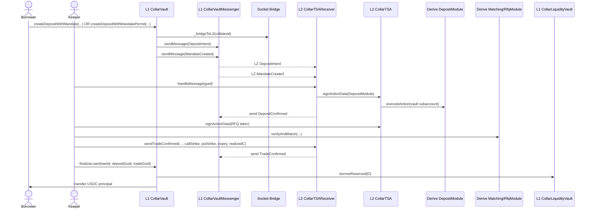
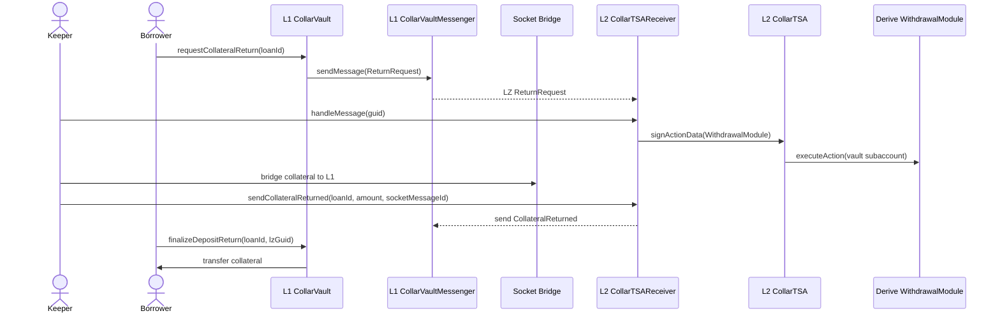
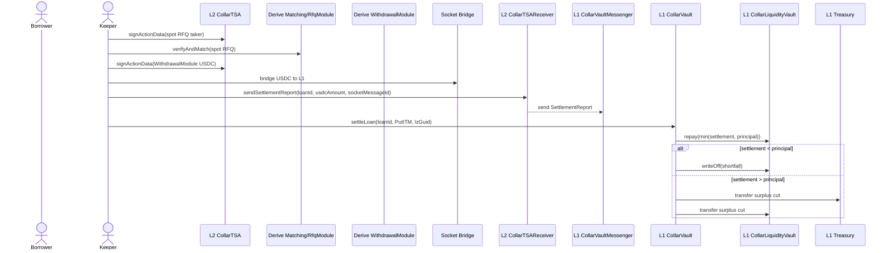
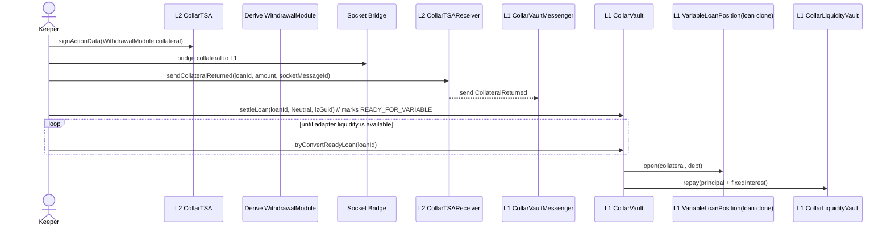
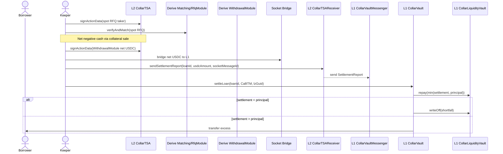

# CollarFi Protocol Technical Specification

Version 1.0 - Draft dated 6 Jan 2026

## 1. Overview

CollarFi is a DeFi lending protocol that issues zero-cost, fixed-maturity USDC loans against crypto collateral (major assets supported by Derive, e.g., WBTC, cbBTC, WETH, wstETH). Each loan is hedged by opening a collar on the Derive exchange: the protocol buys a put option to protect the loan principal and sells a call option to collect enough premium to cover the cost of capital, platform fees and (if necessary) the settlement drag. Upon maturity, three outcomes are possible:

1. Put ITM (underwater): the collateral's value is insufficient to repay the principal. The protocol sells the collateral, collects the put payoff and repays lenders.
2. Neutral corridor: both options expire OTM; the borrower's collateral is still worth at least the principal. The loan converts to a variable-rate loan backed by the same collateral in a money-market vault, or is closed on L1 via deterministic repay-and-close fallback if conversion cannot be completed in time.
3. Call ITM (profit): the collateral appreciates above the call strike. The protocol sells the collateral, pays the call payoff to the option buyer (the market maker) and repays the principal; the borrower receives the upside beyond the call strike.

CollarFi uses Derive's vault architecture and fast bridge to manage the collateral and options on Derive L2 while keeping liquidity and accounting on Ethereum L1 (see Derive official docs: https://docs.derive.xyz/). Liquidity providers deposit USDC into a lending vault; idle funds are deployed into an external ERC-4626 yield vault for variable yield. Borrowers receive USDC loans; market makers quote call strikes; and an off-chain executor places orders on Derive.

This specification documents the smart contracts, off-chain components and flows necessary to implement CollarFi.

## 2. Entities and Components

| Entity/Component | Description |
| --- | --- |
| Borrower | Permissionless user who provides crypto collateral; receives a zero-cost loan; may convert into a variable-rate loan after neutral expiry. |
| Lender | Deposits USDC into an ERC-4626 vault on L1; earns external yield-vault returns and premiums from collars. |
| Vault Contract (L1) | Smart contract controlling collateral, loans and settlement on L1. It does not sign Derive actions. |
| TSA Contract (L2) | `CollarTSA` on Derive L2; inherits `BaseOnChainSigningTSA`, owns the Derive subaccount, and signs actions via ERC-1271. |
| Vault Executor (off-chain) | Authorized signer that prepares and signs orders off-chain, posts them to Derive's API, monitors options positions and triggers settlement. |
| Liquidity Vault (USDC Pool) | ERC-4626 vault storing lender USDC. Integrates with an external ERC-4626 yield vault for idle-funds yield. Tracks available liquidity and active loans. |
| Euler Money Market | Lending market where USDC can be lent and borrowed at variable rates. |
| Derive Subaccount | A single subaccount on Derive L2 owned by the L2 TSA contract via ERC-1271. It holds deposits, open collar positions, and settlement flows. |
| Derive Deposit Module | Module that deposits ERC-20 tokens into a subaccount. Called by the executor using the L2 TSA signature via Derive's API. |
| Derive Withdrawal Module | Module that withdraws ERC-20 tokens from a subaccount back to L1. Called by the executor using the L2 TSA signature via Derive's API. |
| Derive Trade Module | Module that matches limit orders and executes trades (options purchases and sales). |
| Derive Fast Bridge | Socket/L2 messaging bridge used for sending USDC and collateral between L1 and L2 quickly. Bypasses the 7-day challenge period of the canonical OP bridge. |
| Market Maker (MM) | External participant quoting call strikes and premiums for the collar. Accepts the call leg of the options trade. |
| Keeper | Service that triggers settlement at maturity and monitors loan state transitions. |

## 3. Collateral and Bridging Flow

### 3.1 Collateral deposit (L1 -> L2)

When a borrower wants a loan, they can either:
- submit `createDepositWithMandatePermit` on L1 with a Permit2 signature (atomic deposit + signed mandate), or
- submit `createDepositWithMandate` on L1 (standard ERC20 `approve` + `transferFrom`) to create the pending deposit and accept a mandate atomically in one transaction.

In both paths, the borrower provides desired loan parameters (collateral asset/amount, maturity, put strike, desired borrow amount) together with a keeper-signed baseline RFQ mandate payload. The vault pulls collateral (standard, non-rebasing ERC-20 only; use wrapped variants such as wstETH), sends it over the Socket SuperBridge to L2, records a pending-deposit state, and sends `MandateCreated` as part of the same origination transaction. The keeper finalizes the loan later after L2 confirmations and trade confirmation.

Because RFQ execution on Derive requires collateral in the subaccount, the loan lifecycle is asynchronous: collateral must be confirmed on L2 before the RFQ trade can be executed and before the loan is disbursed on L1. At origination, mandate acceptance is atomic with deposit creation. `acceptMandate` remains for post-expiry mandate refresh on an existing pending deposit.

To minimize trust assumptions, the vault sends a LayerZero message alongside the Socket bridge transfer containing the Socket `messageId` and deposit metadata (loanId, asset, amount, subaccountId). A dedicated L2 receiver stores the message and only signs a Deposit Module action once the Socket transfer is confirmed. The L2 receiver then sends a LayerZero `DepositConfirmed` acknowledgment (including the vault recipient, asset and amount) back to L1 so the keeper can finalize state without relying on an off-chain relayer.

Borrowers can cancel deposits directly. If the borrower declines all quotes or the RFQ cannot be executed after the deposit is bridged (e.g., quote expiry or failure to trade), the borrower initiates a return by calling `requestCollateralReturn(loanId)` on L1, which sends a `ReturnRequest` LayerZero message. Once the L2 receiver handles that message, the loan is no longer RFQ-tradeable on L2: no new RFQ taker action may be signed or executed for that loan. The receiver signs a Withdrawal Module action from the vault subaccount, and the executor bridges the collateral back to L1. The L2 receiver sends a `CollateralReturned` LayerZero message including the Socket `messageId` so L1 can finalize once the bridge completes. Because collateral shares a single subaccount with open positions, the L2 receiver MUST only sign the withdrawal when aggregate coverage and cash constraints remain satisfied: `baseBalance - amount >= shortCalls` and cash >= `maxNegCash` (as defined by the strategy contract / risk parameters).
`ReturnRequest` therefore acts as a hard pre-trade cancellation signal on L2. After it is handled, `TradeConfirmed` is invalid for that loan and only the return flow may complete. L1 finalization MUST enforce the same mutual exclusion: `finalizeDepositReturn` must revert if a trade was confirmed, and `finalizeLoan` must revert if collateral was returned.

### 3.2 Collateral withdrawal (L2 -> L1)

Upon loan maturity or variable-rate conversion, the vault executor uses the Withdrawal Module to withdraw collateral or USDC from the subaccount. The fast bridge is used to send funds back to the vault on L1. The vault contract waits for the bridged funds before updating liquidity balances.

LayerZero messages are used to relay withdrawal requests and settlement reports (including the Socket `messageId`) between L1 and L2. For withdrawals, L2 sends a `CollateralReturned` message once the L2->L1 Socket bridge is initiated so L1 can finalize state based on bridge confirmation instead of off-chain attestations. L1 finalization consumes these LayerZero messages and is executed via an L1 transaction (borrower or keeper pays gas).

### 3.3 Deposit/withdraw handlers

For convenience, the vault can implement wrappers that automatically call the deposit or withdrawal modules once the bridge transfer finalizes (see Derive official docs: https://docs.derive.xyz/).

## 4. Derive Vault Architecture

### 4.1 Smart-contract subaccount ownership

Derive uses smart-contract wallets to control subaccounts. The L2 TSA contract (`CollarTSA`) inherits `BaseOnChainSigningTSA`, which implements ERC-1271 signature validation. This allows off-chain signed orders to be validated on chain by Derive when settling trades. The TSA contract:

- Stores a set of authorized signers and submitters. Only the executor (signer) may sign order actions; only designated submitters may submit orders.
- Implements `isValidSignature(bytes32 hash, bytes signature)` to return the ERC-1271 magic value if the signature was produced by an authorized signer and corresponds to a known action (see Derive official docs: https://docs.derive.xyz/).
- Manages nonces and signed data to prevent replay.

### 4.2 Deposit Module

`DepositModule` allows the vault to deposit ERC-20 tokens into its subaccount. Key points:

- Requires one action per call; the action data encodes a `DepositData` struct specifying the amount, asset and whether to create a new subaccount.
- Transfers the deposit asset from the caller to the vault and approves the Derive asset contract.
- Calls the asset contract's deposit function to credit the subaccount.

### 4.3 Withdrawal Module

`WithdrawalModule` withdraws ERC-20 tokens from a subaccount:

- Requires one action with `WithdrawalData` (asset and amount). The subaccount ID must be non-zero.
- Checks the nonce and calls `IERC20BasedAsset.withdraw` to withdraw the specified amount from the subaccount to the owner.
- The TSA only allows withdrawals of the wrapped collateral asset and the cash asset (USDC). Cash withdrawals are limited to the available positive cash balance (no additional borrowing via withdrawal).

### 4.4 Trade Module

`TradeModule` executes limit orders:

- The `executeAction` function processes a batch of `VerifiedAction` objects: the taker (the vault) followed by one or more makers (MMs). It verifies order nonces, decodes order data and trade data, updates oracles if needed, and batches asset transfers. It charges taker fees and matches orders via `_fillLimitOrder`.
- `_fillLimitOrder` enforces price slippage limits, ensures the fill does not exceed the maker's limit or the vault's own maximum, updates filled amounts and adds asset transfers for quote and base token flows.

### 4.5 Strategy contracts

Derive provides various strategy contracts (e.g., CCTSA for covered calls, PPTSA for put spreads). Each extends `CollateralManagementTSA`, which includes deposit/withdraw verification and risk parameters. CollarFi can implement its own strategy contract by inheriting from `CollateralManagementTSA` and overriding `_verifyAction` to enforce conditions specific to zero-cost collars (e.g., strike bounds, maturity windows, option limit prices). The strategy contract may also set management and performance fees for the vault (see Derive docs).

## 5. Loan Lifecycle and Scenarios

### 5.1 Zero-cost loan origination

**User input**: Borrower selects collateral asset `Q`, amount and maturity `t` (must match a Derive-defined expiry). They choose a put strike `K_p` (from a tier) and request to borrow USDC amount `D`.

Requested `D` is constrained by a roll-safety LTV invariant (see §5.1.2):
`D <= collateralAmount * putStrike / strikeScale * maxRollLtv`.

**RFQ estimation + baseline signing (off-chain)**: The off-chain API / vault executor queries market makers and strategy logic to estimate executable collar terms and signs a baseline RFQ for the borrower. The baseline RFQ constrains the on-chain mandate (`callStrike`, `putStrike`, `borrowAmount`, `minNetInterest`, expiry/deadline metadata) and already enforces a cash-safe premium (`C = callPremium - putPremium >= 0`). Strike tiers and valid Derive maturities are enforced by the executor; the vault does not maintain an on-chain tier list or expiry whitelist.

**Collateral deposit (L1 -> L2)**: The borrower either:
- calls `createDepositWithMandatePermit` (Permit2 path), or
- calls `createDepositWithMandate` (standard ERC20 approval path).

Both paths MUST include a keeper-signed RFQ mandate payload and atomically create the pending deposit + accept mandate in one transaction.

In both cases, collateral is bridged to Derive L2 and the loan is placed in pending-deposit state until L2 confirmation and Derive subaccount deposit finalize. No RFQ trade is finalized at this step.

**Subaccount deposit**: After the collateral arrives on L2, the executor calls the Deposit Module with action data (asset: `Q`, amount: `Q`, `managerForNewAccount: true` if new subaccount). This deposits the collateral into the vault subaccount.

**Mandate acceptance (L1)**: Mandate acceptance is atomic at origination in both create paths. The borrower may later refresh mandate constraints on an existing pending deposit via `acceptMandate(loanId, rfq, rfqSig, deadline)` after expiry.

Here `rfq` is a keeper-signed baseline RFQ (EIP-712) that binds the deposit terms and provides baseline `(callStrike, putStrike)` bounds. The vault derives `minCallStrike = rfq.callStrike` and `maxPutStrike = rfq.putStrike`, computes and stores fixed interest from `originationFeeApr`, reserves principal liquidity, enforces the roll-safety LTV bound from §5.1.2, and sends a `MandateCreated` LayerZero message to L2.

LoanId binding rules:
- direct `acceptMandate` requires `rfq.loanId == loanId` (exact binding),
- atomic `createDepositWithMandate` and `createDepositWithMandatePermit` allow `rfq.loanId == 0` as a sentinel because the loanId is assigned in-transaction, while all other RFQ fields and borrower binding are still enforced.

Once a mandate is accepted, the borrower **cannot** request a return until that mandate `deadline` has passed.

Additional mandate checks enforced on-chain:
- `rfq.rfqExpiry` must be valid at acceptance time,
- baseline RFQ hash is one-time use (`usedBaselineRfqs` replay protection),
- an active (non-expired) mandate cannot be replaced,
- borrow amount must satisfy the roll-safety bound `D <= collateralAmount * putStrike / strikeScale * maxRollLtv` for the configured variable-rate adapter route,
- after expiry, borrower may refresh mandate (via `acceptMandate`) or request return.

**Griefing vector (cap lockup) and mitigation**: Without robust quote validation, a borrower could attempt to set an absurdly high `putStrike` and large `borrowAmount` (subject to roll-safety LTV constraints) and then accept a mandate to commit principal and lock the pool cap. This is mitigated by requiring a keeper-signed baseline RFQ at mandate acceptance time:

- The baseline RFQ is EIP-712 signed by an address in `RFQ_SIGNER_ROLE` and must match the pending deposit terms (`collateralAsset`, `collateralAmount`, `maturity`, `putStrike`, `borrowAmount`, `loanId`).
- The baseline RFQ has an explicit `rfqExpiry` and can be made one-time-use via a nonce.
- The borrower can only commit principal by accepting a keeper-signed baseline RFQ, so they cannot unilaterally invent pathological strike/borrow combinations.

**Open collar**: The executor signs and submits an RFQ taker action on Derive:

- Buy a put with strike `K_p` and maturity `t`.
- Sell a call with strike `K_c` and maturity `t`.

No partial fills are allowed; the orders must be fully matched. The trade must conform to risk limits (e.g., delta within bounds) enforced by the strategy contract. Derive matches the order against market makers and settles the trade, crediting or debiting the subaccount accordingly.

After the RFQ taker action is executed from the vault subaccount, the L2 receiver verifies `RfqModule.usedNonces[vaultTSA][takerNonce] == true` and sends a `TradeConfirmed` LayerZero message back to L1.

The `TradeConfirmed` message contains:
- `quoteHash` (optional / informational)
- `takerNonce` (the RFQ taker nonce used on Derive)
- `amount` + `socketMessageId` (metadata; if `amount > 0`, L2 enforces the Socket message finalization check)
- `data = abi.encode(callStrike, putStrike, expiry, realizedC)` to allow L1 to verify executed strikes/expiry and realized net premium economics against the accepted mandate.

**Loan disbursement**: On L1, `finalizeLoan` (keeper) consumes the `DepositConfirmed` LayerZero message for the matching `loanId` (recipient must be the vault, asset/amount must match) and consumes a `TradeConfirmed` LayerZero message. The vault decodes `TradeConfirmed.data` into `(callStrike, putStrike, expiry, realizedC)` and verifies mandate bounds (`callStrike >= minCallStrike`, `putStrike <= maxPutStrike`, `expiry == maturity`) plus economics:

- `realizedC >= 0` and `fixedInterest + realizedC >= minNetInterest`

If valid, the vault opens the loan, borrows reserved principal from the liquidity vault, and transfers USDC principal `D` to the borrower. It records state `ACTIVE_ZERO_COST`, storing `loanId`, `Q`, `K_p`, `K_c`, `t`, principal `D` and subaccount ID.

**Return before trade**: If the RFQ is rejected, expires, cannot be executed after the collateral deposit, or the borrower declines all quotes, the borrower calls `requestCollateralReturn(loanId)` on L1. The vault sends a `ReturnRequest` LayerZero message to L2, and once the receiver handles it the loan can no longer be traded on Derive. The receiver signs a Withdrawal Module action from the vault subaccount if `baseBalance - amount >= shortCalls` and cash >= `maxNegCash`. After the collateral is bridged back to L1, the L2 receiver sends a `CollateralReturned` message; an L1 transaction consumes it, clears the pending deposit, and transfers the collateral back to the borrower.

If a mandate was accepted, the borrower cannot request a return until the latest mandate deadline has passed. After a mandate expires (while still pending/trade-not-finalized), the borrower may either:
- request collateral return, or
- accept a new mandate (refreshing terms/deadline).

Returns and trade confirmation are mutually exclusive at both execution and message level: once `ReturnRequest` is handled on L2, RFQ execution for that loan must revert and the receiver must never send `TradeConfirmed` for it. Conversely, if `TradeConfirmed` was sent first, the receiver must reject a later return request. L1 must revert `finalizeDepositReturn` if `TradeConfirmed` was handled, and must revert `finalizeLoan` if `CollateralReturned` was handled. No variable loan is opened for returned deposits, and subsequent loan creation with that pending deposit is prevented.

### 5.1.1 Mandate economics (fixed-interest cash-safe model)

The agreed origination model is:

- Borrower interest `I` is **fixed at mandate-sign time** on L1 (`acceptMandate`), so borrower repayment terms are deterministic.
- Option net premium is `C = callPremium - putPremium`.
- Execution is cash-safe by construction. Keeper-signed baseline RFQs and finalized trades must satisfy:
  - `C >= 0`
  - `I + C >= minNetInterest`
- Baseline RFQ/mandate/rollover structures carry strike + economics constraints but no deficit-budget field.
- The protocol-critical origination path is collateral-forward only (no required L1->L2 USDC top-up branch).

This keeps borrower obligations deterministic while avoiding deficit-reserve mechanics in the opening path.

### 5.1.2 Roll-safety LTV invariant for variable conversion

To ensure a neutral-expiry loan can be converted into a variable-rate position, origination and rollover MUST enforce a maximum LTV bound against the put-floor collateral value.

Definitions:
- `putFloorValue = collateralAmount * putStrike / strikeScale`
- `rollLtv = borrowAmount / putFloorValue`
- `maxRollLtv` is a governance-configured parameter (scaled by `1e18`) for the selected variable-rate adapter/market route.

Required invariant:
- `rollLtv <= maxRollLtv`
- equivalently, `borrowAmount <= collateralAmount * putStrike / strikeScale * maxRollLtv`

Parameterization guidance:
- Governance sets `marketMaxLtv` from the external variable-rate market (e.g., Morpho cbBTC/USDC at 86%).
- Governance sets a safety buffer `rollLtvBuffer` (e.g., 5%).
- `maxRollLtv = marketMaxLtv - rollLtvBuffer` (e.g., 81%, often rounded down to 80% conservatively).

Worked example:
- Collateral: `1 BTC`
- Borrow amount: `50,000 USDC`
- Configured `maxRollLtv = 80%`
- Required put strike: `K_p >= 50,000 / 0.8 = 62,500`

So a `50,000` USDC loan with `K_p = 50,000` must be rejected because it implies 100% put-floor LTV and may be non-convertible in standard variable-rate markets.

### 5.2 Maturity settlement

At maturity `t`, the executor (or a keeper) settles the collar position on Derive and triggers one of three outcomes. `S_t` is Derive's official expiry settlement price at maturity.

#### Outcome 1: Put ITM / Underwater (`S_t < K_p`)

- Executor requests a spot RFQ on Derive to sell the collateral to USDC. RFQs are full-fill only; the executor sets a `minAmountOut` and retries with a new RFQ if needed.
- Spot collateral sales are executed via the RFQ module only; order-book spot trades are not used.
- The RFQ is executed on Derive; collateral is sold to USDC before any bridging.
- All USDC proceeds (including the put payoff) are withdrawn via the Withdrawal Module. The fast bridge is used to send funds back to L1.
- On L1, the vault contract repays the principal `D` to the lending pool. If proceeds are below `D`, the shortfall is written off against the liquidity vault. If proceeds exceed `D`, the excess is distributed between the liquidity vault and protocol treasury according to a governance-configurable split. The loan state becomes `CLOSED` after bridged funds arrive.

#### Outcome 2: Neutral corridor (`K_p <= S_t <= K_c`)

- Both options expire OTM. The collateral remains on Derive and is not encumbered.
- The vault contract bridges the collateral back to L1 via the fast bridge. The L2 receiver sends a `CollateralReturned` message with the Socket `messageId` so L1 can finalize the conversion once the bridge completes.
- On L1, the loan is marked `READY_FOR_VARIABLE` and collateral is parked in `CollarVault` until conversion liquidity is available.
- Keeper later opens a variable position through a per-loan adapter position contract (1167 clone) controlled by `CollarVault` and repays principal/interest to CLV.
- The resulting variable position remains market-liquidatable (adapter-specific, e.g., Euler or Morpho).

#### Outcome 3: Call ITM / Take profit (`S_t > K_c`)

- Derive's cash system allows negative USDC balances; the short call settlement can create a negative cash balance (i.e., a USDC borrow) in the vault subaccount.
- Executor requests a spot RFQ on Derive to sell the collateral to USDC. RFQs are full-fill only; the executor sets a `minAmountOut` and retries with a new RFQ if needed.
- Spot collateral sales are executed via the RFQ module only; order-book spot trades are not used.
- The RFQ is executed on Derive; the resulting cash balance nets against any negative USDC balance. There is no explicit repay call; repayment occurs by netting the cash balance back to >= 0.
- Only the net positive USDC balance (after the call payoff and any negative cash balance are covered) is withdrawn via the Withdrawal Module and bridged to L1.
- On L1, the vault repays principal `D` to the lending pool from the bridged USDC. If the net bridged amount is insufficient to repay `D`, the protocol backstops the shortfall with L1 liquidity; the borrower receives zero in this case.
- If the net bridged amount exceeds `D`, the excess belongs to the borrower. The vault contract does not make optimistic payouts; the loan state becomes `CLOSED` after bridged funds arrive.

### 5.3 Variable-rate conversion (neutral corridor)

Since the fast bridge is available for all fund movement, the protocol can remove the dAsset receipts previously proposed for slow bridging. Instead:

- Collateral release: Upon neutral maturity, the collateral is unencumbered on Derive. The executor uses the Withdrawal Module to withdraw the collateral to L2 and bridges it back to L1.
- Adapter position open: A per-loan `VariableLoanPosition` clone (EIP-1167) is used to interact with the configured lending adapter.
- Liquidity gate: Keeper retries conversion only when adapter-reported debt-asset liquidity is sufficient.
- LTV safety at conversion: Because origination/rollover enforced §5.1.2 at `K_p`, and neutral outcome satisfies `S_t >= K_p`, realized conversion LTV is guaranteed to be no worse than the configured put-floor bound.
- Accounting: On successful open, the zero-cost loan is transitioned to `ACTIVE_VARIABLE`; debt is tracked on L1 and users interact via `CollarVault` facade calls (`repayVariableLoan`, `withdrawVariableCollateral`).

### 5.3.1 READY_FOR_VARIABLE fallback close (no-oracle)

If a neutral-settled loan remains `READY_FOR_VARIABLE` and cannot be converted immediately (e.g., insufficient adapter liquidity), the protocol supports a deterministic repay-and-close path on L1.

- Let `totalDue = principal + fixedInterest`.
- Borrower self-close window: for `readyLoanCloseGracePeriod` after entering `READY_FOR_VARIABLE`, only the borrower may call `settleReadyLoanByRepay(loanId)`.
  - Caller transfers `totalDue` USDC to the vault.
  - Vault repays LP principal and credits fixed interest.
  - Borrower receives all collateral; loan is closed.
- Keeper forced-close window: after the borrower window expires, only `KEEPER_ROLE` may call `settleReadyLoanByRepay(loanId)`.
  - Keeper transfers `totalDue` USDC to the vault.
  - Keeper receives a deterministic collateral slice computed from put-floor units (no oracle):
    - `baseSeize = ceil(totalDue * strikeScale / putStrike)`
    - `keeperSeize = min(collateralAmount, ceil(baseSeize * (MAX_BPS + readyLoanKeeperPenaltyBps) / MAX_BPS))`
  - Borrower receives `collateralAmount - keeperSeize`.
  - Vault repays LP principal and credits fixed interest; loan is closed.

This fallback avoids adding an on-chain liquidation/oracle subsystem while preserving deterministic closure.

### 5.4 Async rollover (pre-maturity)

Rollover is an asynchronous two-phase cross-chain flow and MUST NOT be finalized from L1-only local state.

1. Borrower signs an EIP-712 rollover mandate on L1 with bounds: `newMaturity`, `minCallStrike`, `maxPutStrike`, `minNetInterest`, `deadline`, `nonce`.
2. Keeper calls `executeRollover` on L1. The vault validates signature/bounds and sends a LayerZero `RolloverIntent` to L2, storing pending rollover state on L1.
3. L2 receiver stores rollover constraints in `CollarLoanStore` (`rolloverPending=true`) and exposes them to TSA RFQ validation.
4. Keeper executes RFQ on Derive. TSA validation enforces rollover bounds from loan-store pending rollover fields, including the roll-safety LTV invariant from §5.1.2.
5. After successful RFQ execution, L2 receiver sends `RolloverConfirmed` to L1 containing mandate linkage and finalized terms (`callStrike`, `putStrike`, `interestApr`, `expiry`).
6. Keeper calls `finalizeRollover` on L1. Finalization is a trusted, authenticated commit step: once a valid `RolloverConfirmed` is present, it applies the confirmed terms, updates accounting, consumes guid, and clears pending rollover.

### 5.4.1 Async rollover safety invariants

- Replay protection: mandate hash can be used only once.
- Hard reverts in `finalizeRollover` are reserved for invalid/forged/mismatched confirmation identity (action, loan, recipient/subaccount, mandate hash, borrower, expiry) or missing pending state.
- Post-open economic/consistency checks (e.g. strike/economics drift vs mandate bounds) MUST NOT brick the loan at finalization; they are signaled as anomalies and enforced pre-trade in TSA RFQ verification.
- `finalizeRollover` is idempotent by confirmation guid (duplicate finalize on an already-consumed guid is a no-op).
- If no valid `RolloverConfirmed` exists, `finalizeRollover` MUST revert.
- While rollover is pending, a second rollover request for the same loan MUST revert.
- Rollover roll-safety: confirmed rollover terms MUST preserve `borrowAmount <= collateralAmount * putStrike / strikeScale * maxRollLtv` for the selected conversion route.

## 6. Smart Contracts and Interactions

### 6.1 Vault contract (L1)

Does not sign Derive actions. All Derive signing and subaccount ownership live in the L2 TSA contract.

All dependent smart contracts should be placed under the `lib/` folder.

Maintains L1 loan records, collateral amounts, and maturity schedules. It relies on L2 messages for Derive execution confirmation.

Provides functions:

- `createDepositWithMandatePermit(params, rfq, rfqSig, deadline, permit, permitSig)` - permissionless Permit2 path; atomically pulls collateral, creates pending deposit, and accepts a signed mandate in one transaction.
- `createDepositWithMandate(params, rfq, rfqSig, deadline)` - permissionless; standard ERC20 approval path that atomically creates the pending deposit and accepts a mandate in one transaction.
- `acceptMandate(loanId, rfq, rfqSig, deadline)` - borrower; refreshes mandate constraints for an existing pending deposit (typically after previous mandate expiry). The vault sets strike bounds, computes fixed interest, reserves principal, enforces roll-safety LTV (`borrowAmount <= collateralAmount * putStrike / strikeScale * maxRollLtv`), and sends `MandateCreated` to L2. Direct calls require exact `rfq.loanId == loanId`; only atomic create paths allow `rfq.loanId == 0` sentinel.
- `requestCollateralReturn(loanId)` - borrower; sends a `ReturnRequest` message to L2 to initiate withdrawal from the vault subaccount (subject to shared-subaccount safety checks). Once handled on L2, the loan is no longer RFQ-tradeable and the return path becomes the only valid pre-trade completion path. If a mandate was accepted, this call must revert until `deadline` has passed.
- `finalizeLoan(loanId, depositGuid, tradeGuid)` - keeper; consumes `DepositConfirmed` and `TradeConfirmed`, validates `(callStrike, putStrike, expiry, realizedC)` against mandate bounds/economics and roll-safety LTV invariants, and then opens/disburses the loan.
- `finalizeDepositReturn(loanId, lzGuid)` - permissionless; consumes the L2 `CollateralReturned` message for a pending deposit and transfers collateral back to the borrower. Must revert if a trade was confirmed for the loan. TODO: decide what to do in case the call reverts as the collateral will be stuck in the `CollarVault`.
- `settleLoan(loanId, outcome, lzGuid)` - restricted to keeper roles; consumes L2 settlement/collateral messages and advances maturity handling. Reverts on-chain if `block.timestamp < maturity`.
- `tryConvertReadyLoan(loanId)` - restricted to keeper roles; retries conversion for `READY_FOR_VARIABLE` loans and opens a per-loan variable position clone once adapter liquidity is sufficient.
- `executeRollover(loanId, mandate, mandateSig, newCallStrike, newPutStrike)` - borrower/keeper flow; starts async rollover by validating borrower mandate, storing pending rollover, and sending `RolloverIntent` to L2.
- `finalizeRollover(loanId, lzGuid)` - keeper; consumes authenticated `RolloverConfirmed` from L2 and commits confirmed rollover terms/accounting on L1.
- `settleReadyLoanByRepay(loanId)` - closes a `READY_FOR_VARIABLE` loan by repaying `principal + fixedInterest` in USDC and releasing collateral deterministically. Borrower-only during `readyLoanCloseGracePeriod`; keeper-only after expiry with strike-based penalty seize.
- `repayVariableLoan(loanId, amount)` - borrower/keeper callable; repays variable debt via the vault facade.
- `withdrawVariableCollateral(loanId, amount)` - borrower/keeper callable; withdraws variable-phase collateral via the vault facade.
- `setMaxTotalPrincipal(max)` - parameter role; caps the total committed principal (pending + active zero-cost loans) to scale TVL gradually.

Exposes events for state changes (`LoanCreated`, `LoanSettled`, etc.).

### 6.2 Off-chain executor

Runs a secure service that:

- Generates `SignedAction` objects (deposit, trade, withdraw) and signs them with the vault's authorized signer.
- Posts actions to Derive's API (e.g., `/post_private-order` for trades).
- Submits trades via the Trade Module, matching orders with market makers.
- Monitors oracle prices and maturity times; triggers settlement via the vault contract.
- Monitors pending collateral deposits, confirms L2 subaccount credit before requesting RFQs or executing trades, coordinates L2 withdrawal execution after borrower-initiated returns, and ensures that a handled `ReturnRequest` permanently blocks further RFQ execution for that loan.
- Coordinates async rollover lifecycle: routes `RolloverIntent` constraints into L2 validation, executes compliant RFQs, and ensures `RolloverConfirmed` is delivered for L1 finalization.
- Interacts with the fast bridge and deposit/withdraw handlers.

### 6.3 Liquidity vault (USDC pool)

Implements ERC-4626 for lenders. Idle USDC is deposited into a configurable external ERC-4626 yield vault; yield accrues to lenders.

Tracks two balances: `availableLiquidity` and `activeLoans`. Lenders can withdraw up to available liquidity; settlement proceeds are reflected once bridged to L1.

Exposes functions `borrow(uint256 amount)` and `repay(uint256 amount)` for the vault contract.

May cap the total notional per maturity bucket to manage risk.

### 6.4 Lending adapter integration (Euler-first)

On neutral maturity, collateral is returned to L1 and parked in `CollarVault`. The loan is marked `READY_FOR_VARIABLE`.

Keeper then retries `tryConvertReadyLoan` opportunistically. Conversion succeeds only when the configured lending adapter reports enough debt-asset liquidity (`availableLiquidity(USDC) >= principal + fixedInterest`).

When liquid, the adapter path deposits collateral on behalf of the borrower and borrows USDC to repay CLV principal + fixed interest. If not liquid, the loan remains in `READY_FOR_VARIABLE` until liquidity unlocks.

Risk configuration for this route MUST include roll-safe LTV parameters used at origination/rollover:
- `marketMaxLtv` (external market maximum borrow LTV),
- `rollLtvBuffer` (governance buffer),
- `maxRollLtv = marketMaxLtv - rollLtvBuffer`.

### 6.5 Bridging contracts

The vault must integrate with the Socket SuperBridge fast bridge on L1. Daily limits and connector fees apply (see Derive/Socket docs).

Events on the bridge are monitored by the deposit/withdraw handlers to trigger module calls on L2.

### 6.6 Pricing and RFQ service

A separate off-chain API / quoting module estimates executable collar parameters and produces a keeper-signed baseline RFQ for mandate acceptance. Inputs include borrower request (asset, amount, maturity, put strike, borrow amount) and MM pricing.

The baseline RFQ is consumed on-chain by `acceptMandate` (or atomically via `createDepositWithMandate`) and constrains trade execution (strike bounds, cash-safe economics floor, expiry/deadline). L1 finalization verifies realized terms from `TradeConfirmed.data` (`callStrike`, `putStrike`, `expiry`, `realizedC`).

### 6.7 Keeper and monitoring

A keeper service must monitor block timestamps and call `settleLoan` once a loan's maturity is reached. It ensures the Derive position is closed and bridging initiated. Settlement uses Derive's official expiry settlement price at maturity (`S_t`).

For neutral outcomes, keeper should:
1. call `settleLoan(loanId, Neutral, lzGuid)` after `CollateralReturned` lands (marks `READY_FOR_VARIABLE`),
2. periodically call `tryConvertReadyLoan` for queued loans,
3. if conversion remains unavailable until `readyLoanCloseGracePeriod` expires, call `settleReadyLoanByRepay` with keeper capital.

For rollover-enabled loans, keeper should also:
1. call `executeRollover` after borrower mandate/signature is available,
2. execute RFQ on L2 only within mandate constraints,
3. call `finalizeRollover` on L1 after `RolloverConfirmed` is available.

Borrower can always self-close via `settleReadyLoanByRepay` during the borrower window.

Monitors for situations such as bridge downtime, fast withdrawal limits, or lending-adapter liquidity shortages; in such cases loans remain queued in `READY_FOR_VARIABLE` until constraints clear.

## 7. Security and Risk Controls

- Signature authenticity: Only authorized signers can sign Derive actions; signatures are validated via ERC-1271 in the L2 TSA contract (see Derive official docs: https://docs.derive.xyz/).
- Replay protection: Nonces are stored per action; signed data cannot be reused or submitted by unauthorized parties.
- Market risk parameters: The strategy contract may set strike ranges, time-to-expiry bounds, and slippage tolerances. The vault must ensure the collateral covers all short calls and that no deposit/withdraw actions leave the subaccount insolvent.
- Origination cap: The L1 vault enforces a maximum total committed principal (pending + active zero-cost loans) to limit aggregate exposure.
- Bridge limits: The fast bridge has daily deposit/withdraw limits (see Derive official docs: https://docs.derive.xyz/). The vault should track cumulative amounts and throttle operations if limits are approached.
- Liquidation risk: Variable-rate loans on Euler are subject to liquidation. The protocol relies on Euler's liquidation mechanisms rather than triggering forced sales.
- Withdrawal race conditions: Because bridging is asynchronous, ensure that bridging calls are idempotent and that funds are not double-counted.
- Oracle reliability: Use multiple price feeds or Derive's TWAP to determine settlement prices. Validate oracle data in the off-chain executor.
- Settlement amount trust: The executor is trusted to compute and report the final settlement amount (including collateral sale proceeds) in `SettlementReport`.
- Derive cash handling: keeper/executor must only execute cash-safe RFQs (`C >= 0`) and settlement paths that preserve solvency and allow conservative L2->L1 accounting.
- Trade confirmation data trust boundary: `TradeConfirmed` carries executed strikes/expiry and `realizedC`; L1 relies on authenticated LayerZero delivery plus configured recipient/subaccount checks when validating this payload.
- Aggregate coverage withdrawals: Withdrawals from the shared vault subaccount must only be signed when `baseBalance - amount >= shortCalls` and cash stays above `maxNegCash`. This is an aggregate (not per-loan) invariant and relies on correct executor operation.
- Return/trade mutual exclusion: Once a `ReturnRequest` is handled on L2, the loan must no longer be RFQ-tradeable and the receiver must not emit `TradeConfirmed` for it. L1 must reject `finalizeDepositReturn` if `TradeConfirmed` was handled, and must reject `finalizeLoan` if `CollateralReturned` was handled.
- Roll-safe borrow bound (mandatory): Origination and rollover MUST enforce `borrowAmount <= collateralAmount * putStrike / strikeScale * maxRollLtv` where `maxRollLtv < 1e18`.
- Governance-configured LTV buffer: `maxRollLtv` MUST be derived from the selected variable-rate market route and configured below market hard limits (e.g., `maxRollLtv = marketMaxLtv - rollLtvBuffer`, with conservative rounding down).
- Neutral-conversion guarantee: Because neutral outcome satisfies `S_t >= K_p`, validating the bound at `K_p` guarantees conversion LTV will not exceed the configured roll-safe threshold for any neutral settlement price.
- READY fallback close is deterministic and oracle-free: collateral seize for post-deadline keeper close is computed from `(totalDue, putStrike, strikeScale, readyLoanKeeperPenaltyBps)` and capped by available collateral.
- Role-based parameter changes: Strike bounds, slippage tolerances, market allowlists and other risk parameters are adjustable by a role controlled by a multisig; governance modules may replace this role later.
- Emergency controls: The protocol supports emergency controls to pause new loans and settlement.

## 8. Deployment and Configuration

- Deploy the L2 TSA contract inheriting from `BaseOnChainSigningTSA`. Configure authorized signers/submitters, derivative asset addresses, and the vault subaccount used for deposits, trades, and settlement.
- Deploy the liquidity vault (ERC-4626), integrate with an external ERC-4626 yield vault and configure deposit/withdraw functions for the vault contract.
- Set up the fast bridge by referencing the Derive bridge contract addresses for each asset and granting necessary approvals.
- Deploy the strategy contract if risk checks or fee schedules are custom. Otherwise, reuse Derive's existing modules.
- Initialize the vault executor with credentials for Derive's API and keys for signing actions.
- Configure keeper services to monitor maturities, bridging events and Euler liquidations.
- Establish RFQ feeds with market makers to obtain call strike quotes and option premiums.
- Configure per-route roll-safe LTV parameters (`marketMaxLtv`, `rollLtvBuffer`, `maxRollLtv`) and ensure quote/origination validation uses them.
- Configure governance/owner roles as a multisig; later upgrades to a governance module are permitted for parameter updates.

## 9. Clarifications and TBDs

The following items are not yet specified and require clarification before implementation:

- Trade verification: implemented via `TradeConfirmed` LZ message after `RfqModule.usedNonces` is set for the taker nonce (quote nonce).
- Shared subaccount accounting: per-loan balance checks are not possible with current Derive action formats. Review whether aggregated withdrawals introduce an attack vector and whether a protocol-level withdrawal pause or stricter withdrawal gating is required (including cancellation/return flows).
- On-chain bounds: strikes and maturities are enforced off-chain by the executor; no on-chain strike/maturity whitelist is required.
- Maturity enforcement: whether Derive-defined maturities are enforced on-chain or only by the executor.
- Fixed-interest timing: fixed borrower interest is computed and stored at mandate acceptance time (`acceptMandate`) and enforced at `finalizeLoan` via `fixedInterest + realizedC` economic checks.

## 10. Conclusion

By leveraging Derive's vault architecture and fast bridge, CollarFi can implement a non-custodial lending protocol that hedges collateralized loans with zero-cost collars. An L2 TSA contract owns the Derive subaccount, and the L1 vault coordinates collateral and settlement via rapid bridging. When options expire neutrally, the collateral is bridged back and deposited into Euler V2 to continue earning yield via a variable-rate loan. Careful configuration of signers, nonces, bridge limits and risk parameters ensures solvency and security for lenders and borrowers alike.
